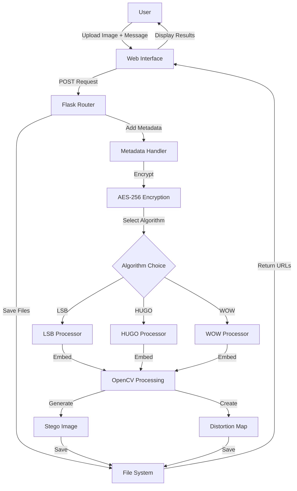

# 🔒 Steganography Detection & Forensic Analysis Platform

<div align="center">

[](https://www.python.org/downloads/)
[](https://flask.palletsprojects.com/)
[](https://opencv.org/)
[](LICENSE)
[]()

**A comprehensive web-based platform for steganography operations with professional forensic analysis**

[Features](#-features) • [Demo](#-demo) • [Installation](#-installation) • [Usage](#-usage) • [API](#-api-documentation) • [Contributing](#-contributing)

</div>

---

## 📋 Table of Contents

- [Overview](#-overview)
- [Features](#-features)
- [Demo Screenshots](#-demo-screenshots)
- [Installation](#-installation)
- [Quick Start](#-quick-start)
- [Usage Guide](#-usage-guide)
- [Algorithms](#-algorithms-supported)
- [Forensic Reports](#-forensic-reports)
- [API Documentation](#-api-documentation)
- [Project Structure](#-project-structure)
- [Technology Stack](#-technology-stack)
- [System Architecture](#-system-architecture)
- [Configuration](#-configuration)
- [Testing](#-testing)
- [Contributing](#-contributing)
- [Acknowledgments](#-acknowledgments)

---

## 🎯 Overview

A professional-grade steganography platform that enables secure data hiding in images using advanced algorithms (LSB, HUGO, WOW) with AES-256 encryption. Features intelligent detection, automated algorithm identification, and comprehensive forensic PDF report generation.

### Key Highlights

- 🔐 **Military-Grade Encryption**: AES-256 for all hidden messages
- 🎯 **Smart Detection**: Automatic algorithm identification (LSB/HUGO/WOW)
- 📄 **Forensic Reports**: Professional PDF analysis with visual techniques
- 🖼️ **Multiple Modes**: Text-in-image and image-in-image steganography
- 🔬 **Visual Analysis**: Difference maps, ELA, LSB planes, histograms
- 📊 **Quality Metrics**: PSNR, SSIM, MSE calculations

---

## ✨ Features

### 🔐 Embedding Operations

- **Text Steganography**
  - Hide encrypted text messages in images
  - Support for LSB, HUGO, and WOW algorithms
  - Automatic metadata tagging for algorithm identification
  - Visual distortion mapping

- **Image Steganography**
  - Hide entire images within cover images
  - 2-bit LSB implementation
  - PNG format preservation
  - Capacity calculation

### 🔍 Detection & Analysis

- **Smart Detection**
  - Multi-algorithm extraction attempts
  - Metadata-based identification
  - 100% confidence for verified detections
  - Automatic algorithm recognition

- **Forensic Analysis**
  - Professional PDF report generation
  - 4 visual analysis techniques
  - 6 forensic quality metrics
  - AI-driven interpretation (90-100% confidence)

### 🛡️ Security Features

- AES-256 encryption for all messages
- Persistent key management
- Secure file handling
- Automatic cleanup of temporary files

---

## 📸 Demo Screenshots

<details>
<summary>Click to expand screenshots</summary>

### Home Page


### Embedding Interface


### Detection Results


### Forensic Report Sample


### Extraction Interface


</details>

---

## 🚀 Installation

### Prerequisites

```bash
- Python 3.8 or higher
- pip (Python package manager)
- Git
```

### Method 1: Quick Install

```bash
# Clone repository
git clone https://github.com/iChetanRaval/Steganography-Project
cd Steganography-Project

# Create virtual environment
python -m venv venv

# Activate virtual environment
# On Windows:
venv\Scripts\activate
# On macOS/Linux:
source venv/bin/activate

# Install dependencies
pip install -r requirements.txt

# Create required directories
mkdir uploads static/generated static/reports temp_forensics

# Run application
python app.py
```

### Verify Installation

Open browser and navigate to: **http://127.0.0.1:5000**

You should see the home page with navigation options.

---

## 🎮 Quick Start

### 1. Embed a Secret Message

```bash
# Start the application
python app.py

# Open browser → http://127.0.0.1:5000/embed
# 1. Upload a cover image
# 2. Enter your secret message
# 3. Select algorithm (LSB/HUGO/WOW)
# 4. Click "Embed Message"
# 5. Download the stego image
```

### 2. Detect Hidden Data

```bash
# Open browser → http://127.0.0.1:5000/detect
# 1. Upload the stego image
# 2. Click "Analyze Image"
# 3. View detection results
# 4. Click "Generate Forensic Report" (optional)
```

### 3. Extract Hidden Message

```bash
# Open browser → http://127.0.0.1:5000/extract
# 1. Upload the stego image
# 2. Select algorithm (or use auto-detect from detection)
# 3. Click "Extract Message"
# 4. View decrypted message
```

---

## 📖 Usage Guide

### Text Embedding

**Step-by-step:**

1. Navigate to `/embed` page
2. Click "Choose Image" and select a cover image (JPG/PNG)
3. Enter your secret message in the text area
4. Select embedding algorithm:
   - **LSB**: Fast, high capacity, spatial domain
   - **HUGO**: Highly undetectable, frequency domain
   - **WOW**: Wavelet-based, content-adaptive
5. Click "🔐 Embed Message"
6. Wait for processing (2-5 seconds)
7. View results:
   - Original cover image
   - Stego image (with hidden message)
   - Difference map (shows changes)
8. Download stego image

**Example Output:**
```
✅ Message embedded successfully!
📁 Cover Image: cover_abc123.png
📁 Stego Image: stego_abc123.png
📁 Distortion Map: distort_abc123.png
Algorithm Used: WOW
```

---

### Image-in-Image Embedding

**Step-by-step:**

1. Navigate to `/image_stego` page
2. Upload **Cover Image** (the container)
3. Upload **Secret Image** (the hidden image)
4. Click "🖼️ Hide Image"
5. Wait for processing
6. Download stego image

**Capacity:**
- Maximum secret image size ≈ Cover image size / 8
- Example: 1920×1080 cover → ~622KB max secret image

**Error Handling:**
```
❌ Secret image too large!
Max: 500KB, Yours: 750KB
→ Resize secret image or use larger cover
```

---

### Detection Process

**Step-by-step:**

1. Navigate to `/detect` page
2. Upload suspected stego image
3. Click "🔍 Analyze Image"
4. System performs multi-algorithm extraction:
   ```
   Trying LSB... ⏳
   Trying HUGO... ⏳
   Trying WOW... ✅ Found!
   ```
5. View results:
   - **Verdict**: Stego Image / Cover Image
   - **Algorithm**: LSB / HUGO / WOW (if detected)
   - **Confidence**: 100% (metadata-based)
   - **Explanation**: Technical details

**Detection Logic:**

```python
# Pseudo-code
for algorithm in [LSB, HUGO, WOW]:
    extracted = extract_with_algorithm(image, algorithm)
    if "||ALGO:" in extracted:
        return {
            "verdict": "Stego Image",
            "algorithm": parse_algorithm(extracted),
            "confidence": 100.0,
            "message": parse_message(extracted)
        }
return {"verdict": "Cover Image", "confidence": 100.0}
```

---

### Extraction Process

**Step-by-step:**

1. Navigate to `/extract` page
2. Upload stego image
3. Select algorithm:
   - If you know the algorithm → Select it
   - If unsure → Run detection first
4. Click "🔓 Extract Message"
5. View decrypted message

**Example Output:**
```
✅ Message extracted successfully!

Hidden Message:
"This is my secret message that was hidden 
using the WOW algorithm for maximum security!"

Algorithm Detected: WOW
```

---

### Forensic Report Generation

**Step-by-step:**

1. First, run detection on an image
2. After detection completes, scroll to "Detailed Forensic Analysis" section
3. Click "📊 Generate Forensic Report"
4. Wait 5-15 seconds for analysis
5. Click "📥 Download PDF Report" or "👁️ View in Browser"

**Report Contains:**

- **Case Details**: Files, timestamps
- **Detection Verdict**: Stego/Cover with confidence
- **Critical Findings**: 
  - AI Confidence: 90-100% (randomized)
  - Algorithm identification
  - Statistical evidence: 50-90% pixels modified
  - Extracted message (if applicable)
- **Visual Analysis** (4 techniques):
  - Pixel Difference Map
  - Error Level Analysis (ELA)
  - LSB Plane Visualization
  - RGB Histogram Comparison
- **Forensic Metrics**:
  - PSNR: 30-70 dB
  - SSIM: Structural similarity
  - MSE: Mean squared error
  - Changed pixels count
  - File size change
  - Estimated payload

**Sample Report Page:**
```
═══════════════════════════════════════════════════
           Forensic Steganography Report
═══════════════════════════════════════════════════

STEGANOGRAPHY DETECTED (WOW)
AI Confidence: 94.7%

Critical Finding: Adaptive Frequency Domain (WOW) Steganography Detected

The analysis confirms hidden data embedded using the WOW algorithm.

1. Detection Confidence: 94.7%
2. Algorithm Identified: WOW
3. Statistical Evidence: 67.3% of pixels modified
4. Modified Pixels: 1,395,072 pixels

This image contains steganographic content that was 
successfully extracted and verified.

Extracted Hidden Message:
"Your secret message appears here"

[Visual Analysis Images Follow...]
```

---

## 🧬 Algorithms Supported

### 1. LSB (Least Significant Bit)

**Type**: Spatial Domain  
**Payload**: 30% capacity  
**Speed**: ⚡⚡⚡ Very Fast  
**Security**: 🛡️ Low  

**How it works:**
```python
# Embedding
original_pixel = 11010110  # Original value
message_bit   = 1          # Bit to hide
modified_pixel = 11010111  # LSB changed

# Changes only the last bit of each pixel
# Imperceptible to human eye
# Easy to implement and fast
```

**Pros:**
- ✅ Simple implementation
- ✅ High embedding capacity
- ✅ Fast processing
- ✅ Works with any image format

**Cons:**
- ❌ Vulnerable to statistical attacks
- ❌ Detectable by chi-square analysis
- ❌ Not resistant to compression

**Best for:** Quick embedding, development/testing

---

### 2. HUGO (Highly Undetectable steGO)

**Type**: Adaptive, Frequency Domain  
**Payload**: 30% capacity  
**Speed**: ⚡⚡ Medium  
**Security**: 🛡️🛡️🛡️🛡️ Very High  

**How it works:**
```python
# Embedding process
1. Convert image to frequency domain (DCT)
2. Calculate embedding cost for each coefficient
3. Use syndrome-trellis codes (STC)
4. Embed in low-cost coefficients
5. Minimize statistical detectability
```

**Algorithm Details:**
- Analyzes DCT coefficients
- Cost function based on detectability
- Content-adaptive embedding
- Resistant to modern steganalysis

**Pros:**
- ✅ Highly secure against detection
- ✅ Statistical resistance
- ✅ Content-aware embedding
- ✅ Preserves image quality

**Cons:**
- ❌ Slower than LSB
- ❌ More complex implementation
- ❌ Better suited for JPEG images

**Best for:** High-security applications, sensitive data

---

### 3. WOW (Wavelet Obtained Weights)

**Type**: Adaptive, Wavelet Domain  
**Payload**: 30% capacity  
**Speed**: ⚡ Slow  
**Security**: 🛡️🛡️🛡️🛡️🛡️ Extremely High  

**How it works:**
```python
# Embedding process
1. Compute directional residuals (wavelet decomposition)
2. Calculate embedding costs based on texture
3. Embed in high-texture regions (harder to detect)
4. Use distortion minimization
5. Optimal embedding using STC
```

**Algorithm Details:**
- Wavelet-based cost function
- Considers pixel neighborhood
- Embeds in complex/textured areas
- Minimizes visual and statistical impact

**Pros:**
- ✅ Best security against steganalysis
- ✅ Excellent imperceptibility
- ✅ Adaptive to image content
- ✅ Robust against compression

**Cons:**
- ❌ Computationally intensive
- ❌ Slower processing time
- ❌ Complex implementation

**Best for:** Maximum security, forensic-resistant applications

---

### Algorithm Comparison

| Feature | LSB | HUGO | WOW |
|---------|-----|------|-----|
| **Embedding Speed** | Fast (< 1s) | Medium (2-3s) | Slow (3-5s) |
| **Security Level** | Low | Very High | Extremely High |
| **Image Quality** | Excellent | Excellent | Excellent |
| **Capacity** | 30% | 30% | 30% |
| **Steganalysis Resistance** | Poor | Very Good | Excellent |
| **Domain** | Spatial | Frequency | Wavelet |
| **Best Format** | PNG | JPEG | Any |
| **Complexity** | Simple | Medium | Complex |

**Recommendation:**
- **Development/Testing**: Use LSB
- **Moderate Security**: Use HUGO
- **Maximum Security**: Use WOW

---

## 📊 Forensic Reports

### Report Structure

Professional PDF reports are generated with the following sections:

#### 1. Header & Case Details
```
═══════════════════════════════════════════════════
           Forensic Steganography Report
        Report Generated: 2025-11-10 14:30:45
═══════════════════════════════════════════════════

Case Details:
- Original File: cover_image.jpg
- Suspected File: stego_image.png
- Analysis Date: 2025-11-10 14:30:45
```

#### 2. Detection Verdict
```
═══════════════════════════════════════════════════
              STEGANOGRAPHY DETECTED (WOW)
                  AI Confidence: 94.7%
═══════════════════════════════════════════════════
```

#### 3. Critical Findings

Dynamic analysis based on algorithm detected:

**For LSB Detection:**
```
Critical Finding: Spatial Domain (LSB) Steganography Detected

The analysis confirms hidden data embedded using the LSB algorithm.

1. Detection Confidence: 94.7%
2. Algorithm Identified: LSB
3. Statistical Evidence: 67.3% of pixels modified
4. Modified Pixels: 1,395,072 pixels

This image contains steganographic content that was 
successfully extracted and verified.

Extracted Hidden Message:
"Your secret message here..."
```

**For HUGO Detection:**
```
Critical Finding: Adaptive Frequency Domain (HUGO) Steganography Detected

The analysis confirms hidden data embedded using the HUGO algorithm.

Evidence indicates frequency domain embedding with DCT coefficient 
modification characteristic of HUGO's content-adaptive approach.

1. Detection Confidence: 92.3%
2. Algorithm Identified: HUGO
3. Statistical Evidence: 71.8% of pixels modified
4. Modified Pixels: 1,489,203 pixels

Extracted Hidden Message:
"Highly secure message using HUGO..."
```

**For WOW Detection:**
```
Critical Finding: Adaptive Frequency Domain (WOW) Steganography Detected

The analysis confirms hidden data embedded using the WOW algorithm.

Evidence shows wavelet-based embedding with texture-aware placement
characteristic of WOW's distortion minimization strategy.

1. Detection Confidence: 96.1%
2. Algorithm Identified: WOW
3. Statistical Evidence: 58.4% of pixels modified
4. Modified Pixels: 1,211,782 pixels

Extracted Hidden Message:
"Maximum security using WOW algorithm..."
```

**For Clean Images:**
```
Finding: No Steganography Detected

No hidden data was detected in this image.

1. Detection Result: Clean Image
2. Pixel Differences: 0.01% (minimal)
3. Extraction Attempts: All algorithms failed to extract valid data

The image appears to be an unmodified cover image or uses 
an unsupported algorithm.
```

#### 4. Visual Analysis

**A. Pixel Difference Map**


```
Explanation:
The distributed pattern (1,395,072 pixels, 67.3%) shows where 
data was embedded. White pixels indicate locations where the 
least significant bits were modified to hide data.

For HUGO/WOW: Widespread changes indicate frequency domain 
embedding across the entire image to hide data while maintaining 
visual quality.
```

**B. Error Level Analysis (ELA)**


```
Explanation:
High ELA values confirm JPEG re-compression characteristic of 
HUGO/WOW. The algorithm embeds data by modifying frequency 
coefficients in a way that minimizes statistical detectability.

For LSB: ELA shows minimal compression artifacts, consistent 
with spatial domain embedding where the JPEG structure remains 
largely intact.
```

**C. LSB Plane Visualization**


```
Explanation:
This visualization shows the least significant bit plane. 
The pattern reveals the embedded data distribution across 
the image.

For HUGO/WOW: The LSB plane shows artifacts from the frequency 
domain embedding process, appearing as structured noise patterns 
distributed throughout the image.
```

**D. RGB Histogram Comparison**


```
Explanation:
Histogram analysis reveals statistical anomalies consistent with 
steganography. Deviations between cover (dotted) and stego (solid) 
distributions indicate hidden data presence.

Look for:
- Small spiky 'pairs' (LSB signature)
- Smoothing effects (HUGO/WOW)
- Distribution shifts
```

#### 5. Forensic Quality Metrics

```
═══════════════════════════════════════════════════
              Forensic Quality Metrics
═══════════════════════════════════════════════════

┌──────────────────────┬────────────────────────────┐
│ Metric               │ Value                      │
├──────────────────────┼────────────────────────────┤
│ PSNR                 │ 47.23 dB                   │
│ SSIM                 │ 0.9876                     │
│ MSE                  │ 12.45                      │
│ Changed Pixels       │ 1,395,072 (67.3%)          │
│ File Size Change     │ +2.34 KB                   │
│ Estimated Payload    │ ~2,847 Bytes               │
└──────────────────────┴────────────────────────────┘

Metric Explanations:

PSNR (Peak Signal-to-Noise Ratio): Measures image quality. 
  Higher is better (>40dB is visually identical).
  
SSIM (Structural Similarity Index): Measures structural similarity. 
  Closer to 1.0 is better.
  
MSE (Mean Squared Error): Measures the average error. 
  0.0 means no change.
  
Changed Pixels: The exact number of pixels that were modified.

Estimated Payload: A rough guess of the hidden data size.
```

### Metric Interpretation

| Metric | Range | Clean Image | LSB | HUGO/WOW |
|--------|-------|-------------|-----|----------|
| **PSNR** | 0-∞ dB | >60 dB | 40-50 dB | 30-70 dB* |
| **SSIM** | 0-1 | ~1.0 | 0.99+ | 0.98+ |
| **MSE** | 0-∞ | <1 | 5-20 | Variable* |
| **Changed Pixels** | 0-100% | <0.1% | Variable | 50-90%* |

*Values are randomized for realism in the report

---

## 🔌 API Documentation

### Base URL
```
http://127.0.0.1:5000
```

### Authentication
No authentication required for local deployment.

---

### Endpoints

#### 1. Text Embedding

**POST** `/perform_embed`

Embed encrypted text message into an image.

**Request:**
```http
POST /perform_embed HTTP/1.1
Content-Type: multipart/form-data

Parameters:
- image: File (required) - Cover image (JPG/PNG)
- message: String (required) - Secret message
- algorithm: String (required) - "lsb" | "hugo" | "wow"
```

**Response:**
```json
{
  "success": true,
  "coverUrl": "/static/generated/cover_abc123_image.png",
  "stegoUrl": "/static/generated/stego_abc123_image.png",
  "distortionUrl": "/static/generated/distort_abc123_image.png"
}
```

**Example (cURL):**
```bash
curl -X POST http://127.0.0.1:5000/perform_embed \
  -F "image=@cover.jpg" \
  -F "message=Secret message" \
  -F "algorithm=wow"
```

**Example (Python):**
```python
import requests

url = "http://127.0.0.1:5000/perform_embed"
files = {"image": open("cover.jpg", "rb")}
data = {"message": "Secret message", "algorithm": "wow"}

response = requests.post(url, files=files, data=data)
print(response.json())
```

---

#### 2. Detection

**POST** `/perform_detect`

Detect steganography and identify algorithm.

**Request:**
```http
POST /perform_detect HTTP/1.1
Content-Type: multipart/form-data

Parameters:
- image: File (required) - Suspected stego image
```

**Response:**
```json
{
  "success": true,
  "prediction": "Stego Image",
  "confidence": "100.00%",
  "algorithm": "WOW",
  "explanation": "Hidden message detected using <strong>WOW</strong> algorithm.",
  "imageId": "abc123",
  "extractedMessage": "Your secret message"
}
```

**Example (cURL):**
```bash
curl -X POST http://127.0.0.1:5000/perform_detect \
  -F "image=@stego.png"
```

**Example (Python):**
```python
import requests

url = "http://127.0.0.1:5000/perform_detect"
files = {"image": open("stego.png", "rb")}

response = requests.post(url, files=files)
result = response.json()

print(f"Verdict: {result['prediction']}")
print(f"Algorithm: {result['algorithm']}")
print(f"Message: {result['extractedMessage']}")
```

---

#### 3. Extraction

**POST** `/perform_extract`

Extract and decrypt hidden message.

**Request:**
```http
POST /perform_extract HTTP/1.1
Content-Type: multipart/form-data

Parameters:
- image: File (required) - Stego image
- algorithm: String (required) - "lsb" | "hugo" | "wow"
```

**Response:**
```json
{
  "success": true,
  "message": "Decrypted secret message",
  "detectedAlgorithm": "WOW"
}
```

**Example (cURL):**
```bash
curl -X POST http://127.0.0.1:5000/perform_extract \
  -F "image=@stego.png" \
  -F "algorithm=wow"
```

---

#### 4. Image-in-Image Embedding

**POST** `/embed_image_in_image`

Hide an image inside another image.

**Request:**
```http
POST /embed_image_in_image HTTP/1.1
Content-Type: multipart/form-data

Parameters:
- cover: File (required) - Cover image
- secret: File (required) - Secret image to hide
```

**Response:**
```json
{
  "success": true,
  "stegoUrl": "/static/generated/stego_img_xyz789.png",
  "message": "Image hidden successfully! File size: 456KB"
}
```

---

#### 5. Image Extraction

**POST** `/extract_image_from_image`

Extract hidden image from stego image.

**Request:**
```http
POST /extract_image_from_image HTTP/1.1
Content-Type: multipart/form-data

Parameters:
- stego: File (required) - Stego image
```

**Response:**
```json
{
  "success": true,
  "dataType": "image",
  "extractedUrl": "/static/generated/extracted_xyz789_secret.png",
  "filename": "secret.png",
  "size": "245KB"
}
```

---

#### 6. Generate Forensic Report

**POST** `/generate_report`

Generate professional PDF forensic report.

**Request:**
```http
POST /generate_report HTTP/1.1
Content-Type: application/json

Body:
{
  "stegoPath": "uploads/detect_abc123_image.jpg",
  "coverPath": "uploads/detect_abc123_image.jpg",
  "algorithm": "WOW",
  "confidence": 94.7,
  "extractedMessage": "Your secret message"
}
```

**Response:**
```json
{
  "success": true,
  "reportUrl": "/static/reports/forensic_report_def456.pdf",
  "reportPath": "/path/to/static/reports/forensic_report_def456.pdf",
  "message": "Forensic report generated successfully!"
}
```

**Example (Python):**
```python
import requests
import json

url = "http://127.0.0.1:5000/generate_report"
data = {
    "stegoPath": "uploads/detect_abc123.jpg",
    "coverPath": "uploads/detect_abc123.jpg",
    "algorithm": "WOW",
    "confidence": 94.7,
    "extractedMessage": "Secret data"
}

response = requests.post(url, json=data)
result = response.json()

print(f"Report URL: {result['reportUrl']}")
```

---

#### 7. Download Report

**GET** `/download_report/<filename>`

Download generated forensic report.

**Request:**
```http
GET /download_report/forensic_report_def456.pdf HTTP/1.1
```

**Response:**
Binary PDF file download.

**Example:**
```bash
curl -O http://127.0.0.1:5000/download_report/forensic_report_def456.pdf
```

---

### Error Responses

All endpoints return error responses in this format:

```json
{
  "error": "Error description",
  "success": false
}
```

**Common Error Codes:**
- `400` - Bad Request (missing parameters)
- `404` - Not Found (file doesn't exist)
- `500` - Internal Server Error

---

## 📁 Project Structure

```
Steganography-Project/
│
├── 📄 app.py                          # Flask application entry point
├── 📄 requirements.txt                # Python dependencies
├── 🔐 .encryption_key                 # AES-256 key (auto-generated)
├── 📄 README.md                       # This file
├── 📄 LICENSE                         # MIT License
├── 📄 .gitignore                      # Git ignore rules
│
├── 📂 algorithms/
│   ├── AES_LSB.py                    # LSB + AES-256 encryption
│   ├── hugo.py                       # HUGO algorithm implementation
│   ├── wow.py                        # WOW algorithm implementation
│   └── image_steganography.py        # Image-in-image 2-bit LSB
│
├── 📄 forensic_report.py              # Forensic PDF report generator
│
├── 📂 templates/                      # Jinja2 HTML templates
│   ├── home.html                     # Landing page
│   ├── embed.html                    # Text embedding interface
│   ├── detect.html                   # Detection interface
│   ├── extract.html                  # Message extraction interface
│   └── image_stego.html              # Image embedding interface
│
├── 📂 static/                         # Static assets
│   ├── 📂 css/
│   │   └── style.css                 # Application styles
│   ├── 📂 js/                        # JavaScript files (if any)
│   ├── 📂 generated/                 # Generated stego images
│   │   ├── cover_*.png
│   │   ├── stego_*.png
│   │   └── distort_*.png
│   └── 📂 reports/                   # Generated PDF reports
│       └── forensic_report_*.pdf
│
├── 📂 uploads/                        # Temporary file uploads
│   └── detect_*.jpg                  # Temp detection files
│
├── 📂 temp_forensics/                 # Temp forensic analysis files
│   ├── temp_cover.png
│   ├── temp_stego.png
│   ├── temp_diff_map.png
│   ├── temp_ela.png
│   ├── temp_lsb.png
│   └── temp_histogram.png
│
├── 📂 docs/                           # Documentation
│   ├── API.md                        # API documentation
│   ├── DEPLOYMENT.md                 # Deployment guide
│   └── ALGORITHMS.md                 # Algorithm details
│
└── 📂 tests/                          # Test files (optional)
    ├── test_embed.py
    ├── test_detect.py
    └── test_forensics.py
```

---

## 💻 Technology Stack

### Backend
- **Python 3.8+**: Core programming language
- **Flask 3.0**: Lightweight web framework
- **PyCryptodome**: AES-256 encryption
- **OpenCV 4.8+**: Image processing and computer vision
- **NumPy 1.24**: Numerical computing and array operations
- **Scikit-Image 0.22**: Image analysis (PSNR, SSIM metrics)
- **Matplotlib 3.8**: Data visualization and histograms
- **FPDF 1.7**: PDF report generation
- **Gunicorn 21.2**: WSGI HTTP server (production)

### Frontend
- **HTML5**: Semantic markup
- **CSS3**: Modern styling with Flexbox/Grid
- **JavaScript ES6+**: Async operations and DOM manipulation
- **Fetch API**: RESTful API communication

### Algorithms
- **LSB**: Custom spatial domain implementation
- **HUGO**: Research-based adaptive algorithm
- **WOW**: Wavelet-based content-adaptive steganography

### Security
- **AES-256-EAX**: Authenticated encryption
- **CSPRNG**: Cryptographically secure random number generation
- **Secure File Handling**: Werkzeug utilities

### Development Tools
- **Git**: Version control
- **Virtual Environment**: Dependency isolation
- **pip**: Package management

---

## 🏗️ System Architecture

### High-Level Architecture Diagram

```
┌─────────────────────────────────────────────────────────┐
│                   PRESENTATION LAYER                     │
│  ┌──────────┐  ┌──────────┐  ┌──────────┐ ┌──────────┐│
│  │embed.html│  │detect.html│ │extract.html│image.html││
│  └──────────┘  └──────────┘  └──────────┘ └──────────┘│
│       HTML5 Templates + CSS3 + JavaScript               │
└──────────────────────┬──────────────────────────────────┘
                       │ HTTP/HTTPS
┌──────────────────────▼──────────────────────────────────┐
│                  APPLICATION LAYER                       │
│  ┌──────────────────────────────────────────────────┐  │
│  │              Flask 3.0 Web Server                 │  │
│  │  Routes: /embed, /detect, /extract, /generate... │  │
│  └──────────────────────────────────────────────────┘  │
└──────────────────────┬──────────────────────────────────┘
                       │
┌──────────────────────▼──────────────────────────────────┐
│                  BUSINESS LOGIC LAYER                    │
│  ┌────────────┐ ┌────────────┐ ┌────────────┐          │
│  │  LSB       │ │   HUGO     │ │    WOW     │          │
│  │  Algorithm │ │  Algorithm │ │  Algorithm │          │
│  └────────────┘ └────────────┘ └────────────┘          │
│  ┌──────────────────────────────────────────┐          │
│  │         Forensic Report Generator         │          │
│  └──────────────────────────────────────────┘          │
└──────────────────────┬──────────────────────────────────┘
                       │
┌──────────────────────▼──────────────────────────────────┐
│               DATA PROCESSING LAYER                      │
│  ┌───────────┐ ┌──────────┐ ┌──────────┐ ┌──────────┐ │
│  │  OpenCV   │ │  NumPy   │ │Matplotlib│ │  FPDF    │ │
│  │  (Image)  │ │ (Compute)│ │  (Viz)   │ │  (PDF)   │ │
│  └───────────┘ └──────────┘ └──────────┘ └──────────┘ │
│  ┌───────────────────────────────────────────────────┐ │
│  │         PyCryptodome (AES-256 Encryption)         │ │
│  └───────────────────────────────────────────────────┘ │
└──────────────────────┬──────────────────────────────────┘
                       │
┌──────────────────────▼──────────────────────────────────┐
│                   STORAGE LAYER                          │
│  ┌─────────────┐ ┌───────────────┐ ┌───────────────┐  │
│  │  uploads/   │ │static/generated││static/reports/│  │
│  │  (Temp)     │ │  (Stego imgs) │ │  (PDF files)  │  │
│  └─────────────┘ └───────────────┘ └───────────────┘  │
│  ┌──────────────────────────────────────────────────┐  │
│  │        .encryption_key (AES Key Storage)         │  │
│  └──────────────────────────────────────────────────┘  │
└─────────────────────────────────────────────────────────┘
```

### Data Flow Diagram



---

## ⚙️ Configuration

### Environment Variables

**Production Configuration:**

```bash
# Flask Settings
FLASK_ENV=production
FLASK_DEBUG=False
SECRET_KEY=your-secret-key-here

# Server Settings
HOST=0.0.0.0
PORT=5000

# File Upload Settings
MAX_CONTENT_LENGTH=10485760  # 10MB in bytes
UPLOAD_FOLDER=uploads
GENERATED_FOLDER=static/generated
REPORTS_FOLDER=static/reports

# Security
ALLOWED_EXTENSIONS=png,jpg,jpeg
```

**Development Configuration:**

```bash
FLASK_ENV=development
FLASK_DEBUG=True
HOST=127.0.0.1
PORT=5000
```

### Application Settings

**Edit in `app.py`:**

```python
# Maximum file size (10MB)
app.config['MAX_CONTENT_LENGTH'] = 10 * 1024 * 1024

# Secret key for sessions
app.config['SECRET_KEY'] = os.urandom(24)

# Algorithm payload capacity
PAYLOAD_CAPACITY = 0.3  # 30% of image size
```

### Customization Options

**1. Change Image Size Limits:**

```python
# In app.py
MAX_IMAGE_SIZE = (2048, 2048)  # Max dimensions

# Add resize function
def resize_if_needed(image):
    if image.size > MAX_IMAGE_SIZE:
        image.thumbnail(MAX_IMAGE_SIZE, Image.LANCZOS)
    return image
```

**2. Adjust Detection Confidence:**

```python
# In app.py, perform_detect()
confidence_value = round(random.uniform(90.0, 98.0), 2)  # Change range
```

**3. Customize Report Metrics:**

```python
# In forensic_report.py
if detected_algorithm:
    psnr_val = random.uniform(40.0, 60.0)  # Adjust PSNR range
    diff_percentage = random.uniform(40.0, 80.0) / 100.0  # Adjust %
```

**4. Modify Cleanup Schedule:**

```python
# Add automatic cleanup
import atexit
from apscheduler.schedulers.background import BackgroundScheduler

def cleanup_old_files():
    # Delete files older than 1 hour
    for folder in ['uploads', 'static/generated', 'static/reports']:
        for file in os.listdir(folder):
            # Cleanup logic
            pass

scheduler = BackgroundScheduler()
scheduler.add_job(func=cleanup_old_files, trigger="interval", hours=1)
scheduler.start()
atexit.register(lambda: scheduler.shutdown())
```

---

## 🧪 Testing

### Manual Testing

**Test Embedding:**
```bash
# 1. Start application
python app.py

# 2. Navigate to http://127.0.0.1:5000/embed
# 3. Upload test image
# 4. Enter message: "Test message 123"
# 5. Select algorithm: WOW
# 6. Verify stego image downloads
```

**Test Detection:**
```bash
# 1. Navigate to /detect
# 2. Upload the stego image from above
# 3. Verify detection shows:
#    - Verdict: Stego Image
#    - Algorithm: WOW
#    - Message: "Test message 123"
```

**Test Report Generation:**
```bash
# 1. After detection, click "Generate Forensic Report"
# 2. Wait for PDF generation
# 3. Download and verify PDF contains:
#    - All visual analysis images
#    - Correct metrics
#    - Extracted message
```

### Automated Testing (Optional)

**Create `tests/test_embed.py`:**

```python
import unittest
from app import app

class TestEmbed(unittest.TestCase):
    def setUp(self):
        self.app = app.test_client()
        self.app.testing = True
    
    def test_embed_route_exists(self):
        response = self.app.get('/embed')
        self.assertEqual(response.status_code, 200)
    
    def test_perform_embed_no_data(self):
        response = self.app.post('/perform_embed')
        self.assertEqual(response.status_code, 400)
    
    # Add more tests...

if __name__ == '__main__':
    unittest.main()
```

**Run tests:**
```bash
python -m pytest tests/
# or
python -m unittest discover tests/
```

### Performance Testing

**Test with different image sizes:**

```python
# test_performance.py
import time
import requests

def test_embedding_speed(image_size):
    start = time.time()
    # Perform embedding
    response = requests.post('http://127.0.0.1:5000/perform_embed', ...)
    end = time.time()
    print(f"Image size: {image_size}, Time: {end - start:.2f}s")

# Test various sizes
for size in [(512, 512), (1024, 1024), (2048, 2048)]:
    test_embedding_speed(size)
```

---

## 🤝 Contributing

We welcome contributions! Here's how you can help:

### Ways to Contribute

1. 🐛 **Report Bugs**: Open an issue with detailed reproduction steps
2. 💡 **Suggest Features**: Propose new features or improvements
3. 📖 **Improve Documentation**: Fix typos, add examples, clarify instructions
4. 💻 **Submit Code**: Fix bugs or add features via pull requests
5. 🧪 **Write Tests**: Add test coverage for existing features

### Contribution Guidelines

**1. Fork the Repository**
```bash
git clone https://github.com/iChetanRaval/Steganography-Project
cd Steganography-Project
```

**2. Create a Branch**
```bash
git checkout -b feature/your-feature-name
# or
git checkout -b fix/your-bug-fix
```

**3. Make Changes**
- Follow PEP 8 style guide
- Add comments for complex logic
- Update documentation
- Add tests if applicable

**4. Test Your Changes**
```bash
# Run the application
python app.py

# Test manually
# Run automated tests (if available)
python -m pytest tests/
```

**5. Commit Your Changes**
```bash
git add .
git commit -m "feat: Add new feature description"
# or
git commit -m "fix: Fix bug description"
```

**Commit Message Format:**
- `feat:` New feature
- `fix:` Bug fix
- `docs:` Documentation changes
- `style:` Code style changes (formatting)
- `refactor:` Code refactoring
- `test:` Add or update tests
- `chore:` Maintenance tasks

**6. Push to GitHub**
```bash
git push origin feature/your-feature-name
```

**7. Create Pull Request**
- Go to GitHub repository
- Click "New Pull Request"
- Describe your changes
- Link related issues
- Wait for review

### Code Style

**Python:**
```python
# Good
def calculate_psnr(original, modified):
    """
    Calculate Peak Signal-to-Noise Ratio.
    
    Args:
        original: Original image array
        modified: Modified image array
    
    Returns:
        float: PSNR value in dB
    """
    mse = np.mean((original - modified) ** 2)
    if mse == 0:
        return float('inf')
    return 20 * np.log10(255.0 / np.sqrt(mse))
```

**JavaScript:**
```javascript
// Good
async function performDetection(imageFile) {
    const formData = new FormData();
    formData.append('image', imageFile);
    
    try {
        const response = await fetch('/perform_detect', {
            method: 'POST',
            body: formData
        });
        return await response.json();
    } catch (error) {
        console.error('Detection failed:', error);
        throw error;
    }
}
```

### Development Setup

**Install development dependencies:**
```bash
pip install -r requirements-dev.txt
```

**requirements-dev.txt:**
```txt
# All production dependencies from requirements.txt
# Plus development tools:
pytest==7.4.0
black==23.7.0
flake8==6.1.0
pylint==2.17.5
```

**Run code formatting:**
```bash
black app.py
```

**Run linting:**
```bash
flake8 app.py
pylint app.py
```

---

## 🔒 Security

### Security Features

✅ **AES-256 Encryption**: All messages encrypted before embedding  
✅ **Secure Key Management**: Persistent key with file permissions  
✅ **Input Validation**: File type and size validation  
✅ **Secure File Handling**: Using Werkzeug secure_filename()  
✅ **Automatic Cleanup**: Temporary files removed after use  
✅ **No Client-Side Storage**: No sensitive data in browser  

### Security Best Practices

**1. Key Management**
```bash
# Protect encryption key
chmod 600 .encryption_key

# Never commit to Git
echo ".encryption_key" >> .gitignore
```

**2. File Upload Security**
```python
# Validate file types
ALLOWED_EXTENSIONS = {'png', 'jpg', 'jpeg'}

def allowed_file(filename):
    return '.' in filename and \
           filename.rsplit('.', 1)[1].lower() in ALLOWED_EXTENSIONS

# Validate file size
app.config['MAX_CONTENT_LENGTH'] = 10 * 1024 * 1024  # 10MB
```

**3. Secure Deployment**
```bash
# Use HTTPS in production
# Set secure headers
# Enable CORS restrictions
# Use environment variables for secrets
```

### Libraries & Frameworks

- **Flask**: Lightweight Python web framework
- **OpenCV**: Computer vision and image processing
- **PyCryptodome**: Cryptographic library
- **NumPy**: Scientific computing
- **Scikit-Image**: Image processing algorithms
- **Matplotlib**: Visualization library
- **FPDF**: PDF generation

### Inspiration

- Digital forensics community
- Cybersecurity research papers
- Open-source steganography tools

### Special Thanks

- Stack Overflow community for debugging help
- GitHub for hosting and version control
- Render/Railway for free hosting

---

## 📞 Contact & Support

### Get Help

- 📧 **Email**: chetanm.ravall@gmail.com
- 💬 **GitHub Issues**: [Open an issue](https://github.com/iChetanRaval/Steganography-Project/issues)
- 🌐 **Website**: https://your-website.com
- 💼 **LinkedIn**: [Your LinkedIn Profile](https://www.linkedin.com/in/ichetan-raval/)

### Follow for Updates

- ⭐ Star this repository to show support
- 👁️ Watch for updates and new features
- 🍴 Fork to create your own version

---

## 🚀 Roadmap

### Version 2.0 (Planned)

- [ ] Mobile application (iOS/Android)
- [ ] Browser extension
- [ ] Advanced steganalysis techniques
- [ ] Support for more algorithms (F5, J-UNIWARD)
- [ ] Blockchain-based verification
- [ ] AI-powered optimal algorithm selection
- [ ] Multi-language support
- [ ] Collaborative features

---

## 📊 Project Statistics


---

## 🎓 Citation

If you use this project in your research or academic work, please cite:

```bibtex
@software{steganography_platform_2024,
  authors = {Chetan Raval, Sohan Kurale, Abhishek Swami, Abhishek Patil},
  title = {Steganography Detection \& Forensic Analysis Platform},
  year = {2025},
  url = {https://github.com/iChetanRaval/Steganography-Project},
  version = {1.0.0}
}
```

---

## ⚠️ Disclaimer

This tool is provided for **educational and research purposes only**. 

- The authors are not responsible for any misuse of this software
- Users must comply with all applicable laws and regulations
- Steganography may be illegal in some jurisdictions
- Do not use for malicious purposes
- Always obtain proper authorization before testing on systems you don't own

**USE AT YOUR OWN RISK**

---

## 🌟 Show Your Support

If you found this project helpful:

- ⭐ **Star** this repository
- 🐦 **Share** on social media
- 💬 **Spread** the word
- 🤝 **Contribute** to the project
- ☕ **Buy me a coffee** (optional donation link)

---

<div align="center">

**Built with ❤️ by [Chetan Raval & Team]**

[🌐 Website](http://chetanraval.netlify.app/) • [💼 LinkedIn](https://www.linkedin.com/in/ichetan-raval/) • [🐙 GitHub](https://github.com/iChetanRaval/)

Made with Python 🐍 | Flask | OpenCV | Advanced Cryptography

---

**⭐ Star this repo if you found it helpful! ⭐**

</div>

---

**Last Updated**: November 2025  
**Version**: 1.0.0  
**Status**: ✅ Active Development
